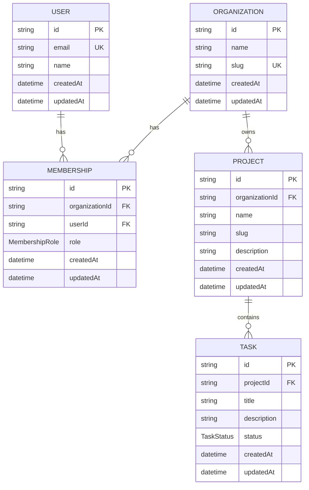

# Database Design

## Purpose

This document describes the Phase 2 relational data model for OpsHub.

The database is implemented in PostgreSQL and managed through Prisma migrations.

The Phase 2 model establishes:

- Multi-tenant organization boundaries
- User membership within organizations
- Organization-owned projects
- Project-owned tasks
- Database-enforced uniqueness and referential integrity
- Indexes for common tenant, filtering, and pagination access patterns

## Technology

- PostgreSQL 17
- Prisma 7.10.0
- Docker Compose for local PostgreSQL
- Prisma migrations for schema evolution

## Entity Relationship Diagram



## Relationship Summary

The model contains five primary entities:

1. `Organization`
2. `User`
3. `Membership`
4. `Project`
5. `Task`

Their relationships are:

```text
Organization 1 ───────< Membership >─────── 1 User

Organization 1 ───────< Project

Project      1 ───────< Task
```

This creates a tenant-oriented hierarchy:

```text
Organization
├── Memberships
│   └── Users
└── Projects
    └── Tasks
```

## Organization

The `Organization` model represents the tenant boundary.

```prisma
model Organization {
  id        String   @id @default(uuid())
  name      String
  slug      String   @unique
  createdAt DateTime @default(now())
  updatedAt DateTime @updatedAt

  memberships Membership[]
  projects    Project[]
}
```

### Primary key

```text
id
```

The ID is generated as a UUID.

### Unique constraint

```text
slug
```

Organization slugs must be globally unique.

### Relationships

An organization can have:

- Zero or more memberships
- Zero or more projects

Deleting an organization cascades through the related foreign-key relationships defined on `Membership` and `Project`.

## User

The `User` model represents an application user.

```prisma
model User {
  id        String   @id @default(uuid())
  email     String   @unique
  name      String
  createdAt DateTime @default(now())
  updatedAt DateTime @updatedAt

  memberships Membership[]
}
```

### Primary key

```text
id
```

### Unique constraint

```text
email
```

Each user email must be unique.

### Relationships

A user can have zero or more memberships.

This allows one user to belong to multiple organizations.

## Membership

The `Membership` model connects users to organizations.

```prisma
model Membership {
  id             String         @id @default(uuid())
  organizationId String
  userId         String
  role           MembershipRole @default(MEMBER)
  createdAt      DateTime       @default(now())
  updatedAt      DateTime       @updatedAt

  organization Organization @relation(
    fields: [organizationId],
    references: [id],
    onDelete: Cascade
  )

  user User @relation(
    fields: [userId],
    references: [id],
    onDelete: Cascade
  )

  @@unique([organizationId, userId])
  @@index([organizationId])
  @@index([userId])
}
```

### Membership roles

```prisma
enum MembershipRole {
  OWNER
  ADMIN
  MEMBER
}
```

The default role is:

```text
MEMBER
```

### Foreign keys

```text
organizationId -> Organization.id
userId         -> User.id
```

Both relationships use cascading deletes.

Deleting an organization removes its memberships.

Deleting a user removes that user's memberships.

### Composite uniqueness

```text
organizationId + userId
```

A user can belong to multiple organizations, but cannot have duplicate memberships within the same organization.

### Indexes

```text
organizationId
userId
```

These indexes support membership lookup from either side of the many-to-many relationship.

## Project

The `Project` model represents work owned by an organization.

```prisma
model Project {
  id             String   @id @default(uuid())
  organizationId String
  name           String
  slug           String
  description    String?
  createdAt      DateTime @default(now())
  updatedAt      DateTime @updatedAt

  organization Organization @relation(
    fields: [organizationId],
    references: [id],
    onDelete: Cascade
  )

  tasks Task[]

  @@unique([organizationId, slug])
  @@index([organizationId])
}
```

### Foreign key

```text
organizationId -> Organization.id
```

Deleting an organization cascades to its projects.

### Tenant-scoped uniqueness

Project slugs are unique within an organization:

```text
organizationId + slug
```

This allows:

```text
Organization A -> project slug "website-redesign"
Organization B -> project slug "website-redesign"
```

while preventing duplicate slugs within the same organization.

### Indexes

```text
organizationId
organizationId + slug
```

The composite unique index directly supports project lookup by tenant and slug.

## Task

The `Task` model represents work contained within a project.

```prisma
model Task {
  id          String     @id @default(uuid())
  projectId   String
  title       String
  description String?
  status      TaskStatus @default(TODO)
  createdAt   DateTime   @default(now())
  updatedAt   DateTime   @updatedAt

  project Project @relation(
    fields: [projectId],
    references: [id],
    onDelete: Cascade
  )

  @@index([projectId])
  @@index([projectId, status])
  @@index([projectId, createdAt(sort: Desc), id(sort: Desc)])
}
```

### Task statuses

```prisma
enum TaskStatus {
  TODO
  IN_PROGRESS
  DONE
}
```

The default status is:

```text
TODO
```

### Foreign key

```text
projectId -> Project.id
```

Deleting a project cascades to its tasks.

### Indexes

The Task model contains three explicit indexes.

#### Project lookup

```text
projectId
```

Supports retrieval of tasks belonging to a project.

#### Project and status filtering

```text
projectId + status
```

Supports queries such as:

```sql
WHERE "projectId" = ?
  AND status = ?
```

Performance testing confirmed that PostgreSQL uses this index at larger data volumes when the planner determines that the index is beneficial.

#### Ordered pagination

```text
projectId + createdAt DESC + id DESC
```

Supports:

```sql
WHERE "projectId" = ?
ORDER BY "createdAt" DESC, id DESC
LIMIT ?
```

This index was added after `EXPLAIN ANALYZE` demonstrated that the previous indexes required PostgreSQL to scan and sort large project task sets.

The matching index allows PostgreSQL to read rows directly in pagination order and stop after satisfying the requested limit.

Detailed measurements are documented in:

```text
docs/architecture/database-performance.md
```

## Multi-Tenant Boundary

The primary tenant boundary is:

```text
Organization
```

Tenant-owned entities currently follow this hierarchy:

```text
Organization
└── Project
    └── Task
```

Membership provides the relationship between users and organizations:

```text
User
└── Membership
    └── Organization
```

A task does not contain an explicit `organizationId`.

Its organization is determined transitively through:

```text
Task
  -> Project
  -> Organization
```

This avoids storing duplicate tenant identifiers in the current model.

Application queries must preserve the organization boundary when retrieving tenant-owned data.

Authorization enforcement belongs to later API and authentication phases.

## Referential Integrity

The database enforces foreign-key relationships for:

```text
Membership.organizationId -> Organization.id
Membership.userId         -> User.id
Project.organizationId    -> Organization.id
Task.projectId            -> Project.id
```

All current foreign-key relationships use:

```text
ON DELETE CASCADE
```

This means deleting a parent entity automatically removes dependent records.

Examples:

```text
Delete Organization
├── Memberships deleted
└── Projects deleted
    └── Tasks deleted
```

and:

```text
Delete User
└── Memberships deleted
```

## Uniqueness Constraints

The database enforces:

| Entity       | Constraint                |
| ------------ | ------------------------- |
| Organization | `slug`                    |
| User         | `email`                   |
| Membership   | `organizationId + userId` |
| Project      | `organizationId + slug`   |

These rules are enforced by PostgreSQL rather than relying only on application logic.

## Timestamps

All five models contain:

```text
createdAt
updatedAt
```

`createdAt` uses:

```prisma
@default(now())
```

`updatedAt` uses:

```prisma
@updatedAt
```

This provides consistent creation and modification timestamps across the relational model.

## Delete Behavior

Current delete behavior is intentionally cascading.

```text
Organization
├── Membership
└── Project
    └── Task

User
└── Membership
```

This model is appropriate for the current Phase 2 lifecycle assumptions.

Later phases may introduce concepts such as:

- Soft deletion
- Audit history
- Data retention policies
- Archival
- Regulatory retention requirements

Those concerns are not part of the Phase 2 model.

## Current Query Access Patterns

The model has been validated against representative operations including:

- List projects by organization
- Retrieve project details with tasks
- Filter tasks by project and status
- List tasks belonging to an organization
- Offset pagination
- Cursor-based pagination
- Project lookup by organization and slug

Representative Prisma queries are implemented in:

```text
packages/database/prisma/queries/representative.ts
```

## Migration Strategy

Schema changes are managed through Prisma migrations.

Current Phase 2 migrations include:

```text
20260826173307_init_relational_model
20260828190239_add_task_pagination_index
```

The initial migration creates:

- Enums
- Tables
- Primary keys
- Foreign keys
- Unique constraints
- Initial indexes

The second migration adds the ordered Task pagination index.

Migrations are intended to be reproducible from an empty PostgreSQL database without manual SQL changes.

Formal empty-database migration validation is performed separately as a Phase 2 release-gate check.

## Seed Strategy

The development seed uses deterministic IDs and known records.

The expected seeded dataset is:

```text
Organizations: 2
Users:         5
Memberships:   6
Projects:      4
Tasks:         12
```

The deterministic seed supports:

- Repeatable development setup
- Representative query validation
- Performance experiments
- Backup and restore validation
- Release-gate testing

The seed is implemented in:

```text
packages/database/prisma/seed.ts
```

## Backup and Restore

The Phase 2 database was successfully exported and restored into an isolated PostgreSQL database.

The restored database preserved:

- Tables
- Data
- Foreign keys
- Unique constraints
- Indexes

The procedure is documented in:

```text
docs/architecture/database-backup-restore.md
```

## Phase 2 Design Principles

The relational model follows these principles:

1. Tenant ownership is explicit through organizations.
2. User-to-organization access is modeled through memberships.
3. Referential integrity is enforced by PostgreSQL.
4. Uniqueness rules are enforced by database constraints.
5. Foreign-key relationships define explicit ownership paths.
6. Indexes correspond to measured application access patterns.
7. Performance changes are validated with `EXPLAIN ANALYZE`.
8. Seed data is deterministic and reproducible.
9. Database evolution is managed through migrations.
10. Backup and restore behavior is validated independently of the active development database.

## Future Considerations

Later phases may extend the relational model with:

- Authentication identities
- Permissions beyond membership roles
- Audit logs
- Soft deletion
- Project ownership or assignment
- Task assignment
- Task comments
- Attachments
- Activity history
- Background jobs
- Search indexes
- Additional tenant-isolation controls

These are intentionally excluded from Phase 2 unless required by later application behavior.
